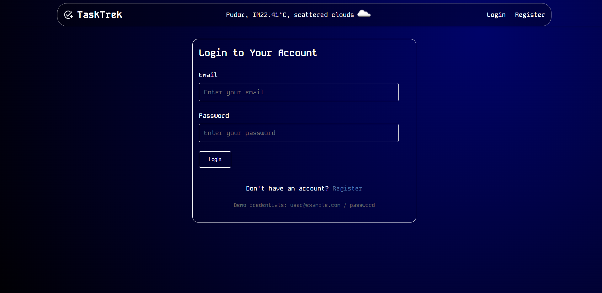
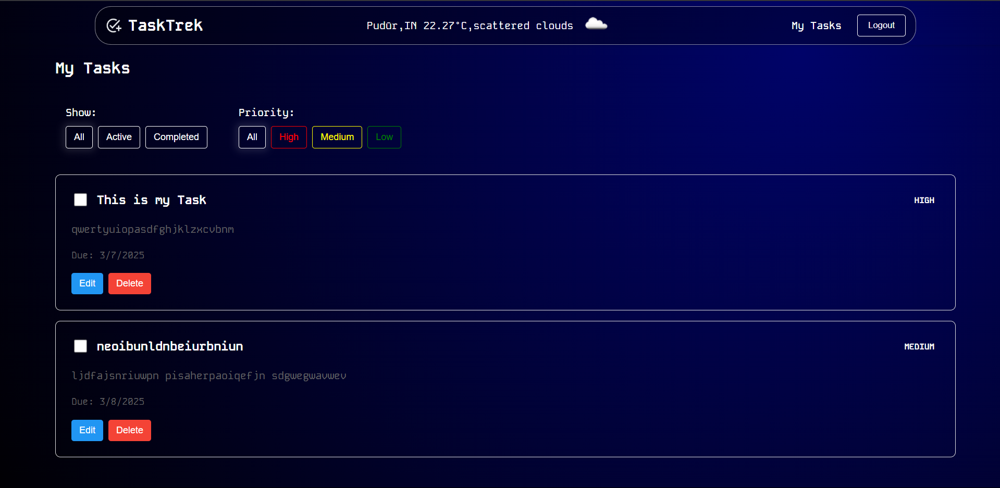
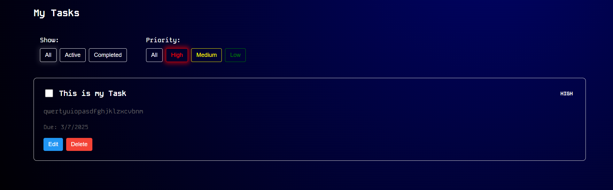
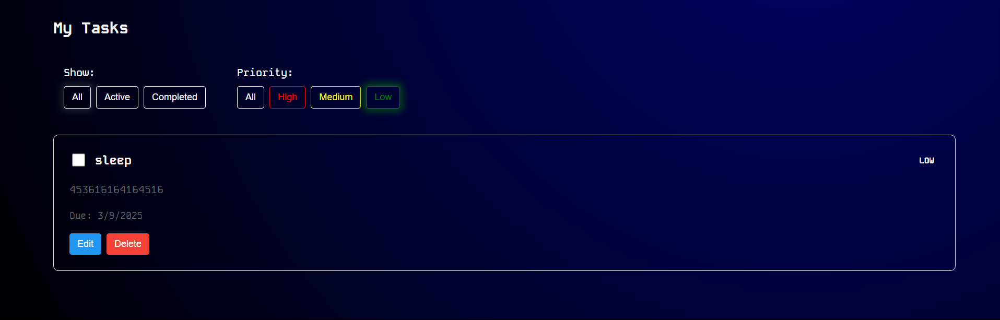
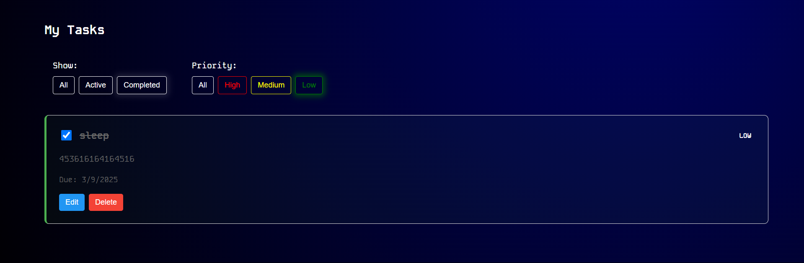

# 🚀 TaskTrek - ToDo Application 📝  

TaskTrek is a modern and efficient ToDo application built with React, Redux, and Vite. It provides a user-friendly interface for managing tasks, featuring task filtering, priority settings, and user authentication.  

## ✨ Features  

-   **🔐 User Authentication:** Secure login and registration functionality for managing user accounts.  
-   **📝 Task Management:** Add, update, and delete tasks with detailed descriptions and due dates.  
-   **🔍 Task Filtering:** Filter tasks by status (All, Active, Completed) and priority (High, Medium, Low).  
-   **📌 Priority Settings:** Assign priority levels to tasks for better organization.  
-   **📦 Redux State Management:** Ensures predictable application behavior with Redux.  
-   **🌤️ Weather Integration:** Displays the current weather in the header using the OpenWeatherMap API.  
-   **🆔 Unique Task IDs:** Each task is assigned a unique ID for proper state management.  

## 🛠️ Technologies Used  

-   ⚛️ **React** – For building the user interface.  
-   📦 **Redux** – For state management.  
-   ⚡ **Vite** – For fast development and build processes.  
-   🛣️ **React Router** – For navigation.  
-   🌦️ **OpenWeatherMap API** – For weather data integration.  
-   🌐 **HTML / CSS / JavaScript** – Core web technologies.  
-   🔑 **`.env` Files** – For secure environment variable storage.  

## 🏁 Getting Started  

### 📋 Prerequisites  

-   Node.js (>=14.0.0)  
-   npm or yarn installed  

### 📥 Installation  

1.  **Clone the repository:**  

    ```bash
    git clone https://github.com/SamP231004/QuadB-Tech-_ToDo-Application
    cd QuadB-Tech-_ToDo-Application
    ```  

2.  **Install dependencies:**  

    ```bash
    npm install  # or yarn install
    ```  

3.  **Set up environment variables:**  

    -   Create a `.env` file in the root directory.  
    -   Add your OpenWeatherMap API key:  

        ```env
        VITE_OPENWEATHER_API_KEY=your_api_key
        ```  

    -   Replace `your_api_key` with your actual API key.  
    -   You will also need to add latitude and longitude values in the header component or allow the browser to access the user's location.  

4.  **🚀 Run the application:**  

    ```bash
    npm run dev  # or yarn dev
    ```  

    The application will be available at [`http://localhost:5173/`](http://localhost:5173/) (or the port specified by Vite).  

### 📦 Build  

To build the application for production:  

```bash
npm run build  # or yarn build
```

## 📸 Screenshots  










